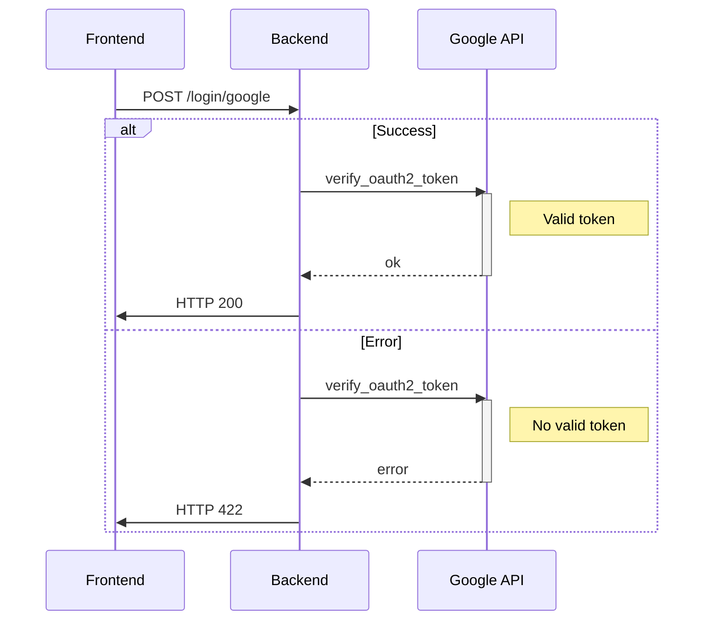

# Introduction

A simple project focused on learning how to integrate frontend and backend using React and Go.
The goal is to login on Google using Google Login javascript, and check if credential is valid by sending a request to google API in backend. After validating credential, a response is sent showing if credential is valid or not.
Take into account a valid google developer account and client are required. There are a lot of tutorials on how to them.

# How to run

There are two components:

- API
- Web

Each one has to be started separately.

## API

Before starting API server, create a .env file with this content
```
GOOGLE_CLIENT_ID=...
```

Place your google client ID insde

In order to start API server, run it using Go >= 1.20

```bash
go run .
```

By default listens on localhost:8080

## Web

Before starting web server, create a .env file with this content
```
GOOGLE_CLIENT_ID=...
```

npm and vite are required to run web server, ensure they are installed at first.

Start web server:

```
npm run dev
```

By default listens on localhost:5173

Given this is a project for learning purposes it is ok to run in development mode.

# Flow
Show a google login in frontend using react and send credential to backend in order to validate it.



## API

## Validate
The purpose of this endpoint is to ensure the client exists and is a valid google user.

### Request

```json
POST /login/google
{
  "credential": "..."
}
```

`credential` is the value returned by the call to Google Login javascript library.
The purpose of this endpoint is to ensure the client exists and is valid. 
In a real world application, there would be a login endpoint which receive credential from google login and creates a JWT token if user exists in database, and is valid.

### Responses

**Valid credential**
```json
HTTP 200

{}
```

**Invalid credential**
```json
HTTP 422

{
  "error": "Error message with details"
}
